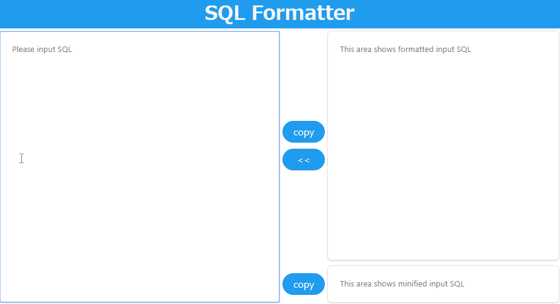

# SQL formatter GUI



## How to run

### Container

build a image

```bash
make
```

run as a container

```bash
docker run --rm -p <your-port>:5000 sql-formatter
```

### Production mode

```bash
yarn start
```

If you have already built the sources, you can start the service as follows:

```bash
yarn serve
```

### Development mode

```bash
yarn start:dev
```
